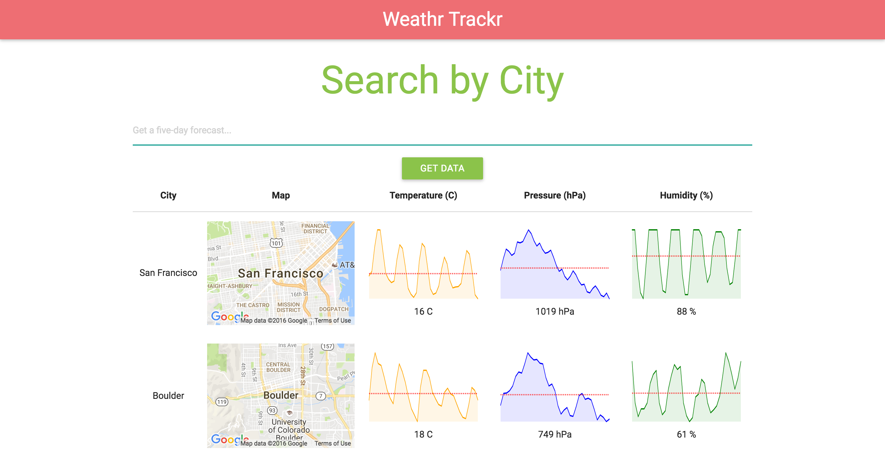

# Real-Time Weather App

This is a Real-Time Weather App that uses React.js, Redux, and Webpack.

## Getting Started

```
git clone https://github.com/freshleaf8865/react-weather-app.git

cd /react-weather-app

npm install

npm start
```

It should not be running on [localhost:8080](http://localhost:8080).

## Purpose

Discover real-time weather data for any city in the United States.

<div style="box-shadow: 0 12px 15px 0 rgba(0,0,0,0.24),0 17px 50px 0 rgba(0,0,0,0.19);"><center></center></a></div>

## Credits

* [Kim T]

## Contributing

1. Fork it

2. Clone your forked repo

3. Make a new branch

4. Make your edits (or add new features!)

5. Make a pull request :D

## License

MIT License. View it [here](LICENSE).
